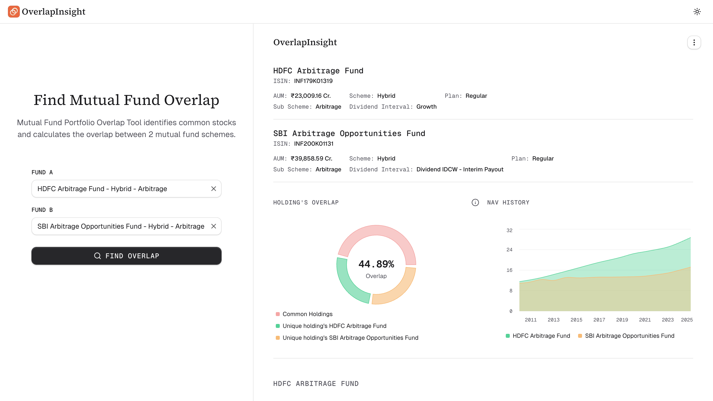

<h1 style="display: flex; align-items: center; justify-content: start; gap: 12px;">
  
  OverlapInsight
</h1>

Analyze mutual fund overlap and common holdings.
Compare portfolios to avoid over-diversification with free tool.



---

**Features**

- Search & compare any two mutual funds with ease.
- Analyze portfolio overlap to understand common holdings and concentration risk.
- Track NAV performance with historical NAV data up to the latest date.
- View complete portfolio details, including individual holdings and sector-wise allocation.

### Development

#### 1. Environment setup

```.env
NEXT_PUBLIC_ENV=dev
NEXT_PUBLIC_FE_URL=http://localhost:3000
```

#### 2. Running in development

```sh
npm install
npm run dev
```
